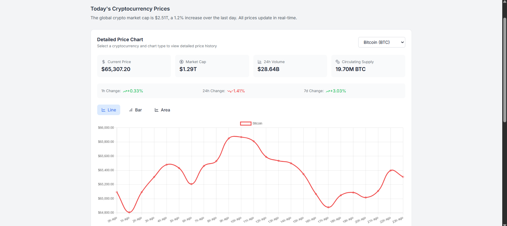
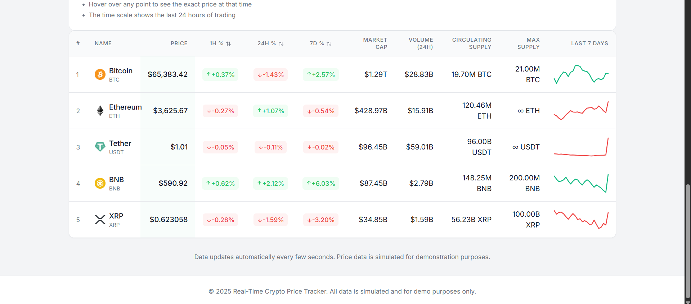

# Real-Time Crypto Price Tracker

[](https://realtime-crypto-tracker.vercel.app)

A fully functional and production-ready web application built with React, Redux Toolkit, Tailwind CSS, and TypeScript. This application provides a live, updating table of cryptocurrency prices and metrics, simulating real-time updates like CoinMarketCap.

## 📌 Features

### Responsive Table UI
- Displays a table of 5 cryptocurrencies: **BTC**, **ETH**, **USDT**, **BNB**, and **XRP**.
- Table columns include:
  - `#` | `Logo` | `Name` | `Symbol` | `Price` | `1h %` | `24h %` | `7d %` | `Market Cap` | `24h Volume` | `Circulating Supply` | `Max Supply` | `7D Chart`
- Sample/mock data for each asset.
- Color-coded percentage changes:
  - **Green** for positive
  - **Red** for negative
- Placeholder 7-day chart (SVG or static image).
- Fully responsive design (mobile to desktop).

### Simulated Real-Time Price Updates
- Simulates real-time updates with `setInterval` and a mock WebSocket class.
- Random updates every 1–2 seconds for:
  - `Price`, `1h %`, `24h %`, `7d %`, `24h Volume`
- Uses Redux actions for updates — no local component state.

### State Management
- Utilizes **Redux Toolkit** for state management:
  - `createSlice`, `configureStore`, `createSelector`.
- Stores all asset data globally in Redux.
- Selectors minimize re-renders.

### Tech Stack
- **React**: Functional components with hooks.
- **Redux Toolkit**: State management.
- **Tailwind CSS**: Styling.
- **TypeScript**: Full type safety for slices, selectors, and components.
- (Optional) **React Icons** for logos or fallback images.

### Bonus Features
- Filter/sort dropdown: **Top Gainers**, **Top Volume**, etc.
- LocalStorage to persist last-seen prices and changes.
- Smooth animations for percentage and price changes using Tailwind transitions.

---

## 🚀 Getting Started

### Prerequisites
- Node.js (v16 or above)
- Package manager (Yarn or npm)

### Installation
1. Clone the repository:
   ```bash
   git clone https://github.com/sujiiiiit/realtime-crypto-tracker.git
   cd realtime-crypto-tracker
   ```
2. Install dependencies:
   ```bash
   npm install
   ```
3. Start the development server:
   ```bash
   npm run dev
   ```

### Deployment
- This application is deployable using Vercel, Netlify, or any static hosting service.
- Includes a production-ready build script:
  ```bash
  npm run build
  ```

---

## 🛠️ Code Structure

```plaintext
src/
├── components/        # UI components (e.g., CryptoTable, CryptoRow, ChartThumbnail)
├── redux/             # Redux slices and selectors
├── data/              # Mock JSON of crypto assets
├── utils/             # Helpers (e.g., number formatting, mock WebSocket)
├── App.tsx            # Main application entry point
├── index.tsx          # React DOM renderer
```


## 🌐 Live Demo

Check out the live demo: [Real-Time Crypto Price Tracker](https://realtime-crypto-tracker.vercel.app)

---

## 📷 Screenshots






---


